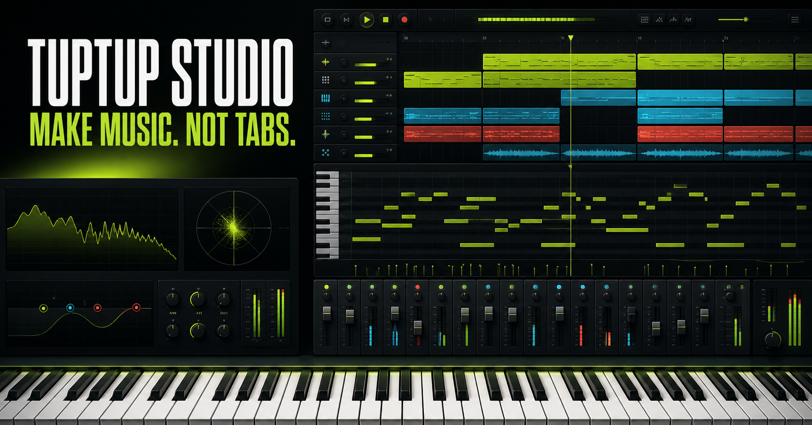

# TupTup Studio — Online MIDI Workstation

[](https://github.com/crazywoola/tuptup-online-midi-piano/actions/workflows/ci.yml)
[](LICENSE)

A browser-based multitrack MIDI workstation for USB MIDI controllers, built
for the **TupTup TS01-MIDI** and its **SAM5704** sound-module input.



## Features

- Stable single-page DAW layout with arrangement, piano roll, mixer, and shared keyboard
- Complete Chinese/English interface with browser-language detection and a persistent header switch
- Web MIDI input with automatic discovery of every available input port
- Explicit support for the TS01's split `TupTup TS01-MIDI` and `SAM5704` ports
- Seventeen sample-backed instruments: 9 studio sounds plus an 8-instrument Chinese suite
- Zero-wait synthesis on the first note, followed by an automatic upgrade to the streamed HD sample
- Safe MIDI.js SoundFont parsing, persistent browser caching, 11-note anchor decoding, and exact-note background decoding
- Per-instrument preview, download/fallback status, retry controls, and an optional 17-instrument Sound Check
- A dismissible three-step first-loop coach that keeps the full professional workspace available
- Tempo, metronome, loop transport, recording, playback, mute, solo, and arm
- Piano-roll note drawing, selection, duplication, quantize, humanize, and deletion
- Step input from the screen, computer, or MIDI keyboard directly into the piano roll
- MIDI file import/export plus local project save and JSON project export
- Live Note On/Off visualization across a stable 61-key shared piano
- Sustain pedal support through MIDI CC 64
- Mouse, touch, and computer-keyboard fallback controls
- Responsive drawers, dialogs, keyboard shortcuts, and reduced-motion support
- A bilingual feature guide at `/guide` with recording and editing walkthroughs

## Requirements

- Node.js 22.13 or newer for local development
- A desktop Chromium browser with Web MIDI support for USB hardware input
- HTTPS or localhost, because Web MIDI requires a secure browser context

Safari and embedded webviews may not expose Web MIDI. For hardware testing,
use the current desktop version of Chrome or Edge.

## Quick start

```bash
git clone https://github.com/crazywoola/tuptup-online-midi-piano.git
cd tuptup-online-midi-piano
npm ci
npm run dev
```

Open the local URL shown in the terminal, connect the controller over USB,
choose **连接设备**, and approve the browser permission prompt.
Use the **中 / EN** control in the header to switch the whole workstation language.

## How the TS01 connection works

The controller exposes two CoreMIDI/Web MIDI inputs:

| Input | Purpose |
| --- | --- |
| `TupTup TS01-MIDI` | Controller interface |
| `SAM5704` | Piano Note On/Off data |

The app opens and listens to all available MIDI inputs. This is intentional:
on the tested TS01 hardware, the physical piano keys send notes from
`SAM5704`, even though the device is marketed as `TupTup TS01-MIDI`.

## Scripts

| Command | Purpose |
| --- | --- |
| `npm run dev` | Start the local development server |
| `npm run build` | Create the production Cloudflare Worker build |
| `npm run lint` | Run ESLint and accessibility checks |
| `npm run typecheck` | Run TypeScript without emitting files |
| `npm run test:unit` | Test SoundFont parsing, mappings, caching, timeout, and pitch fallback |
| `npm run audit:samples` | Download and validate every remote SoundFont plus the local erhu WAV |
| `npm test` | Build and run the rendered-page tests |

## Architecture

- React 19 and TypeScript for the workstation interface and sequencer state
- Web MIDI API for hardware input
- Web Audio API for low-latency multitimbral sample playback, synthesis, and metronome playback
- Versioned Cache Storage for raw FluidR3 SoundFonts; decoded `AudioBuffer` objects stay in memory only
- vinext and Cloudflare Workers for the application runtime
- CSS for the responsive piano and performance feedback

### Sample loading lifecycle

Every instrument has a deterministic source in `lib/soundfont.ts`. Sixteen use
the browser-ready FluidR3 GM collection, and erhu uses the attributed Berklee
BISA recording in `public/samples/chinese/`.

The first note never waits for the network: TupTup plays its matching synth
fallback and starts the sample request in the background. A FluidR3 file is
normally about 1.7–3 MB. When it arrives, the app decodes 11 anchors across the
61-key performance range and switches later notes to sampled playback. Exact
pitches decode in the background; until then the nearest anchor is
pitch-shifted. Raw responses persist in the versioned `tuptup-soundfonts-v2`
browser cache, while decoded buffers are released when the tab closes.

Use **Sound Check** beside the sound-library heading to preview, retry, or
explicitly check all 17 instruments. The full check uses roughly 30–45 MB and
is never run automatically. A 15-second timeout, a failed request, or a failed
MP3 decode always leaves the synth fallback playable.

MIDI events and audio stay in the browser. The app does not upload performance
data or require an account.

The complete instrument library uses CC BY audio from Berklee BISA and FluidR3 GM. See
[THIRD_PARTY_SAMPLES.md](THIRD_PARTY_SAMPLES.md) for source links, attribution,
licenses, adaptations, and instrument mappings.

## Contributing

Issues and pull requests are welcome. Read [CONTRIBUTING.md](CONTRIBUTING.md)
before submitting a change. Please report security concerns according to
[SECURITY.md](SECURITY.md).

## License

Released under the [MIT License](LICENSE).
